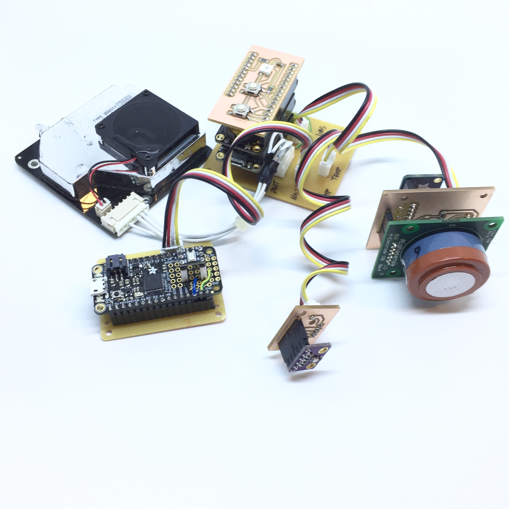
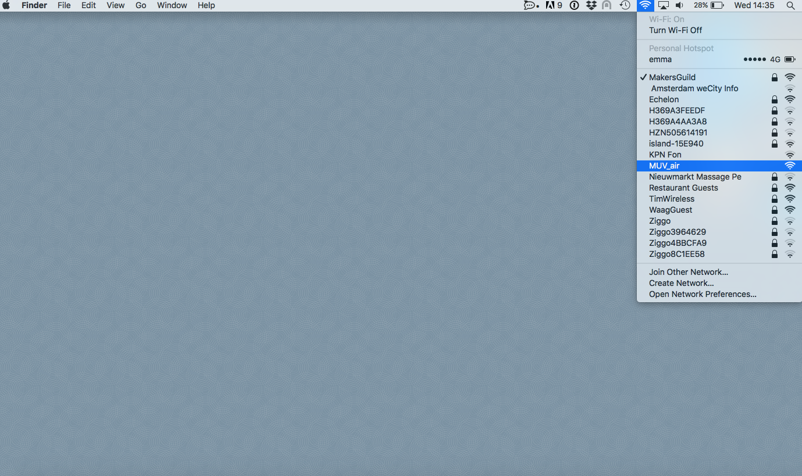
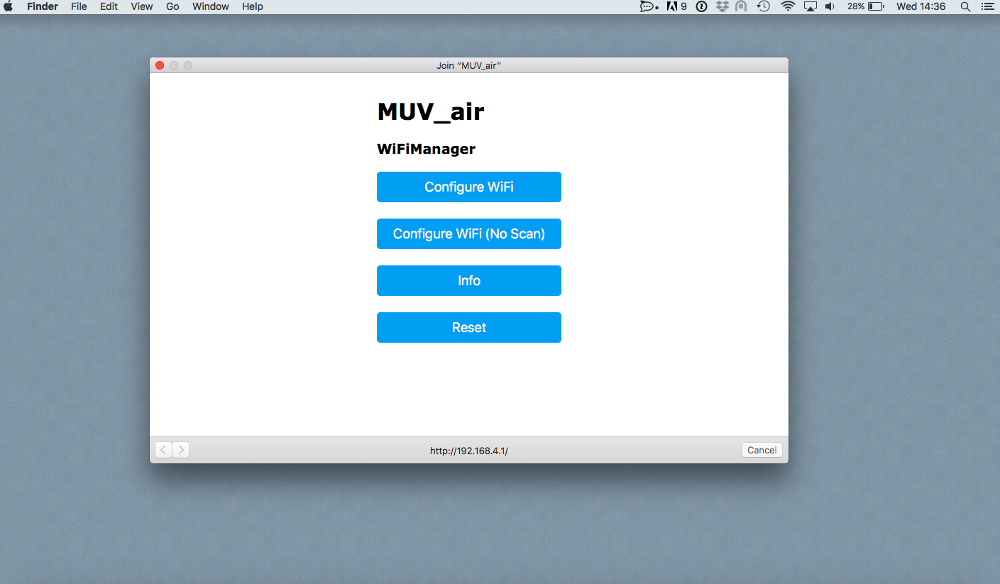
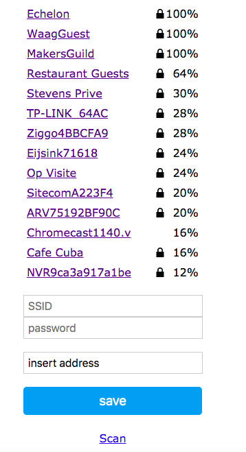
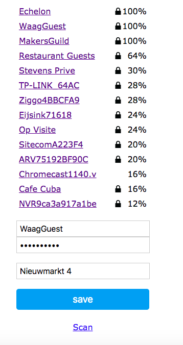
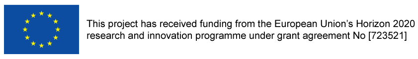

# Air quality sensor kit for MUV

This repository is about the Sensors Kit developed for the project [MUV](https://www.muv2020.eu/) and contains the following parts:
- this page: you will find on this page the instructions on how it works.
- [Sensors](https://github.com/waagsociety/air_quality_sensor_kit/tree/master/MUV%20Kit/Sensors) folder: it contains the list of sensors that can be connected to the Kit.
- [Hardware](https://github.com/waagsociety/air_quality_sensor_kit/tree/master/MUV%20Kit/Hardware) folder: it contains digital files, original design files, layout view, instruction on how to produce the pcbs in a fablab, gerber files and BOM.
- [Firmware](https://github.com/waagsociety/air_quality_sensor_kit/tree/master/MUV%20Kit/Firmware) folder: it contains the sketches used in the Kit.
- [Case](https://github.com/waagsociety/air_quality_sensor_kit/tree/master/MUV%20Kit/Case) folder: it contains the instructions for the case.

## Intro
The MUV Sensors kit is a device developed to measure the following environmental quantities:
* dust
* temperature/humidity/pressure sensor
* noise
* nitrogen dioxide and ozone.

The kit has a WiFi module that collects the data from the sensors and send them to the MUV MQTT-server. If the WiFi is missing the kit saves the data on an SD-card.

NOTE: when you power on the kit, it must be able to connect to a WiFi otherwise it will not start the measurements.

Once the Kit is powered on and connected to the WiFi it will run automatically.

### Connect the Sensor Kit to the local WiFi
Power on the SK (Sensor Kit), plugging the USB cable. If the kit is not connected to the WiFi, the Led on the interface board is on/blue, the kit is ready to be connected, it is in configuration mode and it creates a network named MUV_air.
At this point you need a smartphone/tablet or computer, join the network MUV_air.

Automatically on the device you are using (smartphone/tablet/computer) the configuration window will pop-up.

If the window doesn't appear, open a browser and go to the address: http://192.168.4.1/.

Clicking on Info, you can see the information related to the kit and find the kit ID that in the window is called Chip ID.
Clicking on Configure WiFi, you are in the right place to connect the kit to you local WiFi.

Select the WiFi and type the password.
In the tag "Insert address", write the location of the kit.

   

Click save and the kit will try to connect to the WiFi, the Led turns green for 5 sec before to go off and the kit starts the measurements.

** NOTE **
In case you want to change the location, you can enter configuration mode using the Config switch on the interface board: keep pushed the Config switch and reset the kit (press once the reset switch). Hold the Config switch until the Config Led turns blue.

### Operational mode
When you power the kit on, the Led stays on/red while connecting to the WiFi. If it can't connect, it goes in configuration mode, if it has the right credentials the Led turns on/green and after 5 seconds it goes off. Every time the data are pushed to the cloud, the Led blinks green if the uplink is successful. If the payload can't reach the server, the Led turns on/orange and the data are saved on the SD-card. If the kit is disconnected from the WiFi and can't save the data on the sd-card, the Led stays on/red.

### Credits

 

[*MUV* – Mobility Urban Values –](https://www.muv2020.eu) levers behavioural change in local communities using an innovative approach to improve urban mobility: changing citizens’ habits through a game that mixes digital and physical experiences.

Rather than focus on costly and rapidly ageing urban infrastructures, MUV promotes a shift towards more sustainable and healthy mobility choices by engaging in a positive way local communities, local businesses, policymakers and Open Data enthusiasts.

MUV solutions will be open, co-created with a strong learning community of users and stakeholders, and piloted in a set of diverse urban neighbourhoods spread across Europe: Amsterdam (NL), Barcelona (ES), Fundao (PT), Ghent (BE), Helsinki (FI), Palermo (IT).

Mobility and environmental data gathered via the mobile app and the monitoring stations will allow policymakers to enhance planning processes and civic hackers to build new services able to improve cities’ quality of life in a more effective way.

