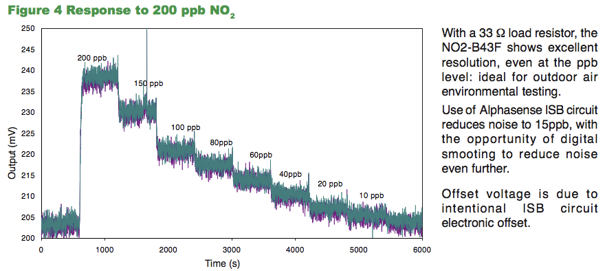

# Air quality sensor kit for MUV
The kit developed for MUV is a modular system on which the following sensors can be attached:
* dust sensor
* temperature/humidity/pressure sensor
* noise sensor
* gases sensors

The pcbs used in the kit are both off-the-shelf products and produced in the fablab.

## Dust sensor
The dust sensor is the [SDS011](http://aqicn.org/sensor/sds011/) from [inovafitness](http://inovafitness.com/en/a/chanpinzhongxin/95.html) and it uses the principle of laser scattering technology. The device is capable to measure the concentration of PM2.5, nominally it measures also PM10 but research papers shows the fact that the PM10 measurement is an extrapolation based on PM2.5 data.
Based on such results we will use the sensor to measure only PM2.5. The communication between the sensor and the main mcu is over serial.

The specifications are:
- Output: PM2.5, PM10
- Measuring Range: 0.0-999.9μg/m3
- Input Voltage:5V
- Maximum Current: 100mA
- Sleep Current:2mA
- Response Time1 second
- Serial Data Output Frequency: 1 time/second
- Particle Diameter Resolution:≤0.3μm
- Relative Error:10%
- Temperature Range:-20~50°C
- Physical Size: 71mm*70mm*23mm

The dust sensor doesn't need any support pcb, the cable you get with the sensor can be used to plug the device to the main sensors board, see hardware XXX.

## Temp/Hum/Pressure sensor
To measure temperature and humidity, the kit include the [BME280 sensor](https://www.bosch-sensortec.com/bst/products/all_products/bme280). The operation ranges are: 
Pressure: 300...1100 hPa 
Temperature: -40…85°C 

The average current consumption (1Hz data refresh rate) is: 
1.8 μA @ 1 Hz (H, T) 
2.8 μA @ 1 Hz (P, T) 
3.6 μA @ 1 Hz (H, P, T) 
and the average current consumption in sleep mode is 0.1 μA.

The Humidity sensor: 
Response time (τ63%): 1 s
Accuracy tolerance: ± 3 % relative humidity
Hysteresis: ≤ 2 % relative humidity

The Pressure sensor: 
RMS Noise: 0.2 Pa (equiv. to 1.7 cm)
Sensitivity Error: ± 0.25 % (equiv. to 1 m at 400 m height change)
Temperature coefficient offset: ±1.5 Pa/K (equiv. to ±12.6 cm at 1°C temperature change)

It uses I2C or SPI communication interface, in the kit it adopts the first one.

## Noise sensor
The microphone included in the kit is the [ICS‐43432](https://www.invensense.com/wp-content/uploads/2015/02/ICS-43432-data-sheet-v1.3.pdf) from [Invensense](https://www.invensense.com/products/ics-43434/) and it features:

* Digital I²S Interface with High Precision 24‐bit Data  
* High 65 dBA SNR
* −26 dB FS Sensitivity
* ±1 dB Sensitivity Tolerance
* Wide Frequency Response from 50 Hz to 20 kHz
* Low Current Consumption: 1.0 mA
* High Power Supply Rejection: −80 dB FS
* 116 dB SPL Acoustic Overload Point
* Small 4 mm × 3 mm × 1 mm Surface‐Mount Package
* Compatible with Sn/Pb and Pb‐Free Solder Processes  
* RoHS/WEEE Compliant  

this sensor has its own dedicated mcu that is capable to run 44100 Khz sample frequency and I2S interface. the board is the Adafruit feather M0 basic, see hardware. XXX

## Gas sensors
the kit is designed to read up to two electro-chimical sensors from [Alphasense](http://www.alphasense.com/).
Two are the sensors that are recommended:
- Nitrogen dioxide
- Ozone

### NO2 sensor
The sensor is the NO2-B43F embedded on the [ISB individual sensor board](http://www.alphasense.com/index.php/air/downloads/) from Alphasense. The specifications of sensor are:
- Sensitivity nA/ppm at 2ppm No2 : -175 to -450
- Response time t90 (s) from zero to 2ppm NO2: < 60
- Zero current  nA in zero air at 20°C :  -50 to +70
- Noise* ±2 standard deviations (ppb equivalent) : 15
- Range  ppm NO limit of performance warranty : 20
- Linearity ppb error at full scale, linear at zero and 5ppm NO2 : < ±0.5
- Overgas limit maximum ppm for stable response to gas pulse : 50

### O3 sensor

## Calibration
The dust and the gas sensors requires a calibration process to validate the data.
